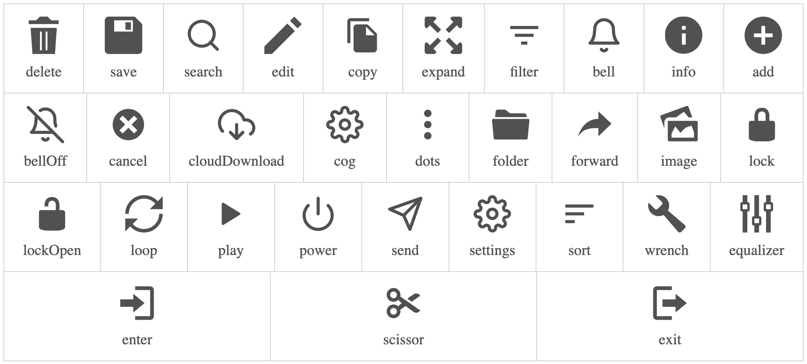

# React context menu


A lightweight and customizable React component for implementing context menus. It supports dynamic menu generation, flexible styling options,
and both predefined and custom menu icons.

This makes it ideal for applications requiring dynamic right-click menus with full control over behavior and appearance.


## Key build-in features

- ✅ Dynamic Menu items 
- ✅ Predefined icons
- ✅ Custom icons
- ✅ Multiple context menu implementation.


## 📦 Installation

```bash
npm install react-menu-context
```
## 🚀 Usage

```js
import {ContextProvider, ContextMenu}  from "react-menu-context";


const menuItems=[
  {
    label:'Cut',  
    onClick:()=>{console.log('delete')},
    iconType:'scissor',
  },
  {
    label:'Copy task',
    onClick:()=>{console.log('delete')},
    iconType:'copy',
  },
  {
    label:'Edit content',
    onClick:()=>{console.log('delete')},
    icon:<CustomIcon/>,
  },
  {
    label:'Move to trash',
    onClick:()=>{console.log('delete')},
    iconType:'delete',
    disabled:true
  }
]

function App() {
  return (
    <ContextProvider id={123} className='custom-styling-name'>
      <button>Right clik context action</button>
      <ContextMenu 
        menuItems={menuItems}
        className='custom-class-name'
        id={123}
      />
    <ContextProvider/>
    
  );
}
```

## ContextProvider
A React component that wraps and manages the display logic of the context menu.

### props

| Name | Type | Default | Description |
| ---  | ---  | ------  | -------     |
| id   | string, number |             | The identfier that binds to ContextMenu.                       |
| disabled | boolean    |   false     | A boolean flag indicating whether the context menu is visible. |
| className| string     |             | A custom `className` for enabling custom styling for the wrapper `div` of the context. |

## ContextMenu
A React component that displays a list of contextual menu options in response to right click.

### props
| Name | Type | Default | Description |
| ---  | ---  | ------  | -------     |
| id   | string, number |             | The identfier that binds ContextMenu with ContextProvider.     |
| className | string    |             | A custom `className` for enabling custom styling for the wrapper `div` of the context menu. |
| menuItems | array     |             | Array of menu items object in the context menu. |

### MenuItem
A data structure that defines a specific menu displayed in the context menu interface.

| Name | Type | Default | Description |
| ---  | ---  | ------  | -------     |
| label| string |                     | The label or text for the context menu.               |
| icon | component |                  | A custom component for icon.                          |
| iconType| string |                  | built-in icon types identified by name.               |
| onClick | function |                | function call when the specific menu item is clicked. |
| disabled | boolean | false          | Whether the menu item should be active or not         |


## Icons
>[!NOTE]
>There are two type of icons in the context menu
>1. built-in icons
>2. custom icons

### built-in icons



The built-in icons can be added to the menu item by providing a name to the `iconType`
```js
{
  ...,
  lable:'Move to trash'
  iconType:'delete'
},
{
  ...,
  label:'Save data'
  iconType:'save'
}
```
### custom icons
If necessary, custom icon can be provided to the context menu. The Custom menu can be a component that returns a svg icon, or i am image tag. 

```js
  const MenuIcon=()=>{
    return(
      <svg>
          <path> ... </path>
      </svg>
    )
  }

  const menuItems=[
    {
      label:'Custom icon menu',
      icon:<MenuIcon />,
      onClick:{()=>console.log()}
    },
    {
      label:'Custom image menu',
      icon:,
      onClick:{()=>console.log()}
    }
  ]
```